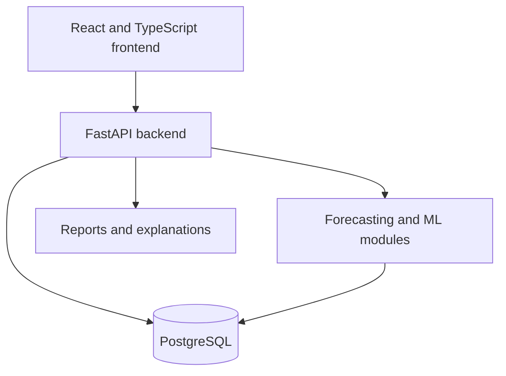

# FALCON Project Baseline

| Field | Value |
| --- | --- |
| Project | FALCON |
| Title | AI-Augmented Multi-goal Financial Advisor with Cognitive Forecasting |
| Status | Phase 0 — scope and architecture baseline |
| Baseline date | 5 August 2026 |
| Primary developer | Pradyumna P. |

## 1. Product definition

FALCON is an India-first, international-ready personal-finance decision-support web application for individuals with regular or irregular income.

It will help users understand their financial behaviour, identify avoidable spending, forecast future cash flow, manage multiple financial goals and compare possible financial decisions.

FALCON provides educational decision support. It does not replace a qualified financial adviser and will not guarantee financial outcomes.

## 2. Product objectives

FALCON will:

- Build a user-specific financial dataset from user-provided information.
- Record and import income, expenses, accounts, debts, budgets and savings.
- Categorize transactions and learn from user corrections.
- Detect spending leaks, subscriptions and unusual transactions.
- Forecast income, expenses, savings and cash flow.
- Plan and prioritize multiple financial goals.
- Recommend explainable savings allocations.
- Compare best, expected and worst-case scenarios.
- Estimate goal-completion probability and financial risk.
- Calculate financial-health and improvement scores.
- Generate understandable reports, warnings and recommendations.
- Protect users through secure authentication, data export and complete deletion.

## 3. Target users

FALCON is designed for individual users who have:

- Regular salaried income.
- Irregular, freelance or business income.
- One or more short-term or long-term financial goals.
- Existing loans, EMIs or other financial responsibilities.
- Limited knowledge of formal financial planning.

The first release will be India-first:

- INR will be the default currency.
- Indian date, number and financial formats will be supported.
- The database will store ISO currency codes so international support can be added.
- International exchange rates must eventually come from a trusted live API.

## 4. Committed product scope

### 4.1 Authentication and privacy

- Mandatory user authentication.
- Email and password registration.
- Email verification.
- Login and logout.
- Forgot-password and password-reset flows.
- Optional Google sign-in after the primary authentication flow works.
- User data export.
- Complete account and data deletion.

### 4.2 Financial profile

- Personal and household responsibilities.
- Regular and irregular income sources.
- Accounts and opening balances.
- Debts, loans and EMIs.
- Budgets and savings.
- Emergency-fund position.
- Financial goals.
- Risk-profile questionnaire.
- Income stability and past financial behaviour.

### 4.3 Data input

The first implementation order is:

1. Manual entry.
2. CSV import.
3. Excel import.
4. PDF bank statements.
5. Credit-card statements.
6. Paytm, PhonePe and Google Pay exports.

Users must be able to review, correct, edit and undo imported information before it affects recommendations.

### 4.4 Transaction intelligence

- Income and expense tracking.
- Transaction categorization.
- Merchant and description normalization.
- User correction learning.
- Split transactions.
- Recurring-payment and subscription detection.
- Spending-pattern analysis.
- Financial-leak detection.
- Unusual-transaction and anomaly warnings.
- A configurable well-being or discretionary-spending allowance.

### 4.5 Forecasting

FALCON will compare multiple forecasting approaches:

- Simple statistical baselines.
- XGBoost-based forecasting.
- ARIMA and SARIMA time-series models.
- Prophet where appropriate.

The system will evaluate the candidates and select the best-performing suitable model for each user and forecast target.

LSTM models are deferred until sufficient data and a proven need exist.

Forecasting rules:

- Forecasts may be produced with limited history.
- Limited data must result in visibly lower confidence.
- Three months of usable history is the minimum threshold for normal-confidence eligibility.
- Actual reliability must still depend on data quality and validation metrics.
- Training, validation and testing must follow chronological order.
- Future information must never leak into model training.
- Model versions and evaluation results must be recorded.

Forecast outputs will include:

- Expected values.
- Confidence ranges.
- Best, expected and worst-case outcomes.
- Goal-completion probability.
- Risk score.
- Likely events that could break the plan.
- Plain-language explanations.

### 4.6 Goal planning and optimization

- Multiple simultaneous goals.
- Goal amount, target date and priority.
- Explainable goal ranking.
- Personalized savings allocation.
- Goal contribution schedules.
- Debt and EMI-aware planning.
- Emergency-fund protection.
- Scenario simulation.
- Monte Carlo simulation when sufficient inputs are available.
- Comparison of alternative decisions.
- Approval and version history for generated plans.

### 4.7 Dashboard and reports

- Financial-health score.
- Income, expense, savings and cash-flow summaries.
- Goal progress.
- Forecast confidence and warnings.
- Spending leaks and detected anomalies.
- Monthly improvement score.
- Savings streaks, milestones and badges.
- Monthly PDF report.
- CSV transaction export.
- Goal-plan schedule.
- Scenario-comparison report.

### 4.8 Conversational assistant

The assistant will be available through a separate button, popup or side panel.

It must:

- Use authenticated user data only with permission.
- Explain dashboard values and recommendations.
- Answer questions using backend-calculated financial results.
- Avoid inventing balances, forecasts or financial facts.
- Clearly communicate uncertainty.

## 5. Out of scope for the first release

The first release will not include:

- Direct money transfers or payments.
- Storage of bank, card or UPI credentials.
- Automatic access to bank accounts.
- Stock, mutual-fund or specific investment-product recommendations.
- Guaranteed financial outcomes.
- A native Android or iOS application.
- An administration panel.
- A microservices architecture.
- MongoDB as a primary database.
- LSTM models without sufficient data.
- Features that require real personal data during development.

MongoDB may be evaluated later only for a proven document-oriented or retrieval-augmented generation requirement.

## 6. Architecture baseline

FALCON will begin as a modular web application rather than separate microservices.

